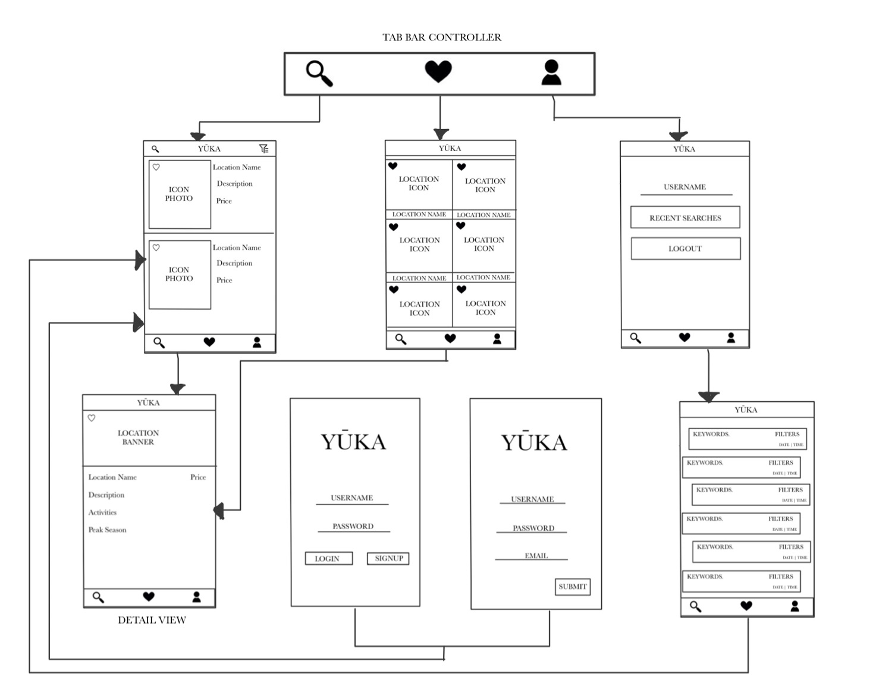

# Yuka

## Table of Contents
1. [Overview](#Overview)
1. [Product Spec](#Product-Spec)
1. [Wireframes](#Wireframes)

## Overview
### Description
Vacation planning app, allows user to input preferences and will curate a vacation to their liking.

### App Evaluation
- **Category:** Productivity / Social
- **Mobile:** This app would be primarily developed for mobile but would perhaps be just as viable on a computer, such as tinder or other similar apps. Functionality wouldn't be limited to mobile devices, however mobile version could potentially have more features.
- **Story:** Allows users to plan out their vacation using their preferences, and crafting their own experiences
- **Market:** Anyone that likes to travel enjoy this app. Ability to favorite based on interests and categories allows users with unique interests to engage in.
- **Habit:** This app could be used as often or unoften as the user wanted depending whether they want to just explore their surroundings on and off the trip. A "stay-cation" is an equal opportunity too.
- **Scope:** We plan to have the app start on the local level maybe even the national level, and then expand globally when we have investors and/or people tht would allow us access to their databases so we can include them.

## Product Spec
### 1. User Stories (Required and Optional)

**Required Must-have Stories**

* Users can log in or sign up
* User can view recommended locations to visit and enter detailed view when tapped
* User can save planned trips and start again after app is closed
* User can view favorites from a favorites fragment 
* Profile pages for each user
* User can see recent searches from their profile fragment

**Optional Nice-to-have Stories**

* User can leave reviews of places they visited or vacations they planned and taken
* Page of most visited trips or most favorited trips/locations
* Profile Add-On: settings page
* Allow users to interact with others on the same trip/ allow a private mode 
* Planning to go on a trip with other individuals and share contact information. 

### 2. Screen Archetypes

* Login 
* Register - User signs up or logs into their account
   * Upon Download/Reopening of the application, the user is prompted to log in to gain access to their profile information 
* Detail Screen 
   * Upon selecting location, user will be met with the location's name a small description and the price for the pre-planned vacation if vacation is made.
   * If it is an actual location then the location's name is displayed along with a small description, some activities that can be done, and the peak season when people travel there.
* Stream screen: 
    * Favorites:The locations/ vacations the user favorited will come up and you will beable to tap and get the detailed view of both
    * Recent searches: The user will be able to see the different searches they made along with the filters they included to get the results the user wanted 
* Profile Screen 
   * Allows user to upload a photo, view recent searches, and log out.
   
### 3. Navigation

**Tab Navigation** (Tab to Screen)

* Search
* Favorites
* Profile

Optional:
* Reviews
* Discover (Top Choices)

**Flow Navigation** (Screen to Screen)
* Forced Log-in -> Account creation if no log in is available
* Search  -> Detailed screen (-> to reviews if optional)
* Favorites  -> Detailed screen (-> to reviews if optional)
* Profile -> Searches (from Recent Searches) 

## Wireframes


## Schema 
### Models
#### Location

| Property      | Type     | Description |
| ------------- | -------- | ------------|
| objectId      | String   | unique id for the user post (default field) |
| description   | String   | Description of location |
| activities    | String   | Activities to do at location |
| peakSeason    | JSONObject| Peak seasons where location is most popular|
| LocationBanner | File     | image of location for detail view |
| LocationIcon  | File     | image of location for thumbnail view |
| LocationName  | String   | Name of location |
| LocationCountry  | String   | Name of country |
| LocationStates  | String   | Name of State |
| LocationCity  | String   | Name of City |
| LocationAttraction  | String   | Name of Attraction |
| filter        | boolean  | Whatever is used to specify the search or deter the search from using it's default settings |

#### Search

| Property      | Type     | Description |
| ------------- | -------- | ------------|
| objectId      | String   | unique id for the user post (default field) |
| favorites     | boolean  | Whether you like the location or not |
| keyWord       | String   | Word(s) that the user typed in to make search |
| createdAt     | DateTime | date when post is created (default field) |

#### Profile

| Property      | Type     | Description |
| ------------- | -------- | ------------|
| userName      | Pointer to User| Name of user to display on profile |
| recentSearches | String   | user inputted keywords to help with search |
| favorites     | boolean  | Whether you like the location or not |

### Networking
#### List of network requests by screen
   - Search/Feed Screen
      - (Read/GET) Query set of random locations
        ```java
        ParseGeoPoint userLocation = (ParseGeoPoint) userObject.get("location");
        ParseQuery<ParseObject> query = ParseQuery.getQuery("PlaceObject");
        query.whereNear("location", userLocation);
        query.setLimit(10);
        query.findInBackground(new FindCallback<ParseObject>() { ... });
        ```
  
      - (Create/LOCATION) Create a new favorite on search
      ```java
      ParseGeoPoint point = new ParseGeoPoint(0.5, 0.5);
      ParseQuery<ParseObject> query = ParseQuery.getQuery("PlaceObject");
      query.wherePolygonContains("location", point);
      ```

      - (Delete) Delete existing favorite
      ```java
      // After this, the favoriteName field will be empty
      myObject.remove("favoriteName");
      ```
      
      - (Create/LOCATION) Create new search
      ```java
      ParseQuery<ParseObject> query = ParseQuery.getQuery("Location");
      query.whereFullText("name", "Tallahassee");
      ```

      - (Update/PUT) Update search through filter
      ```java
      ParseQuery<ParseObject> query = ParseQuery.getQuery("GameScore");
      query.whereEqualTo("playerEmail", "dstemkoski@example.com");
      query.getFirstInBackground(new GetCallback<ParseObject>() {
        public void done(ParseObject object, ParseException e) {
          if (object == null) {
            Log.d("score", "The getFirst request failed.");
          } else {
            Log.d("score", "Retrieved the object.");
          }
        }
      });
      ```

   - Detailed View Screen
      - (Read/GET) Query all known information on Location
      ```java
      ParseQuery<ParseObject> query = ParseQuery.getQuery("Place");
      query.whereWithinMiles("location", userGeoPoint, 10.0);
      query.findInBackground(new FindCallback<ParseObject>() {
        @Override
        public void done(List<ParseObject> list, ParseException e) {
          if (e == null) {
            // List of places within 10 miles of a user's location
          }
        }
      });
      ```
  
   - (Create/LOCATION) Create a new favorite on search
      ```java
      public void addFavorite(Context context, FavList fav){
      List<FavList> favorites = getFavorites(context);
      if(favorites == null)
      favorites = new ArrayList<FavList>();
      favorites.add(fav);
      saveFavorites(context,favorites);
      }
      ```
      
    - (Delete) Delete existing favorite
      ```java
      public void done(final List<ParseObject> scoreList, ParseException e) {
      if (e != null) {
      // There was an error or the network wasn't available.
      return;
      }
      // Release any objects previously pinned for this query.
      ParseObject.unpinAllInBackground(TOP_SCORES_LABEL, scoreList, new DeleteCallback() {
      public void done(ParseException e) {
      if (e != null) {
        // There was some error.
        return;
      }
      // Add the latest results for this query to the cache.
      ParseObject.pinAllInBackground(TOP_SCORES_LABEL, scoreList);
      }
      });
      }
      });
      ```
   - Favorites Screen
      - (Read/GET) LocationName and location Icon
      ```java
      ParseQuery<ParseObject> query = ParseQuery.getQuery("Location");
      query.getInBackground("xWMyZ4YEGZ", new GetCallback<ParseObject>() {
      public void done(ParseObject object, ParseException e) {
      if (e == null) {
      // object will be your game score
      } else {
      // something went wrong
      }
      }
      });
      ```
      
     - (Delete) Delete existing favorite   
      ```java 
      public void done(final List<ParseObject> scoreList, ParseException e) {
      if (e != null) {
      // There was an error or the network wasn't available.
      return;
      }
      // Release any objects previously pinned for this query.
      ParseObject.unpinAllInBackground(TOP_SCORES_LABEL, scoreList, new DeleteCallback() {
      public void done(ParseException e) {
        if (e != null) {
          // There was some error.
          return;
        }
        // Add the latest results for this query to the cache.
        ParseObject.pinAllInBackground(TOP_SCORES_LABEL, scoreList);
       }
       });
       }
       });
       ```
   - Profile Screen
      - (Read/GET) Query logged in user object
      ```java
          public String getUsername(){
        return this.USERNAME;
        }
      ```

